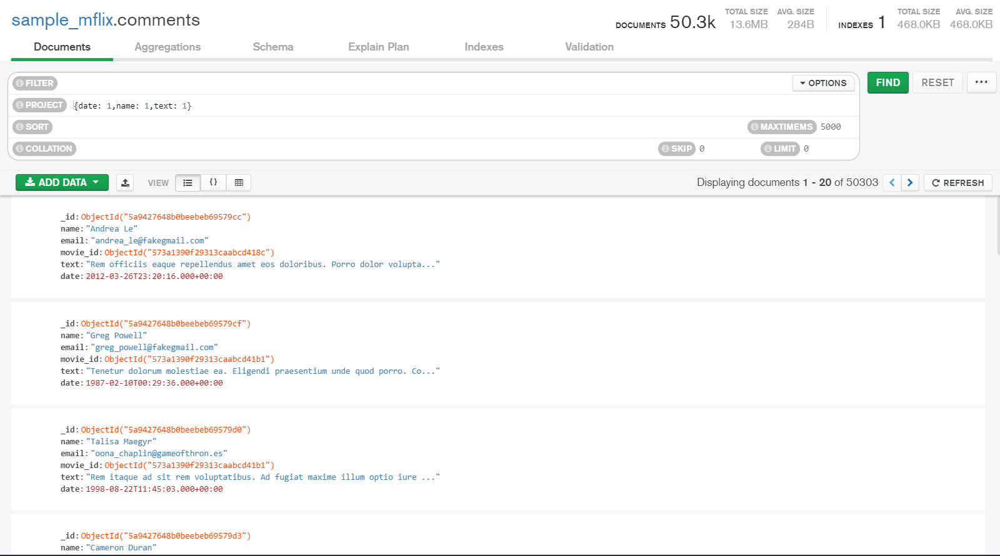
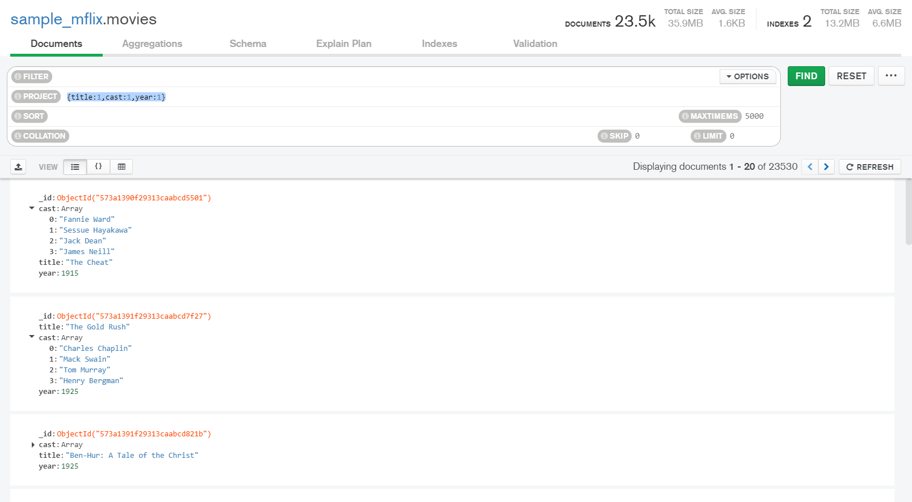
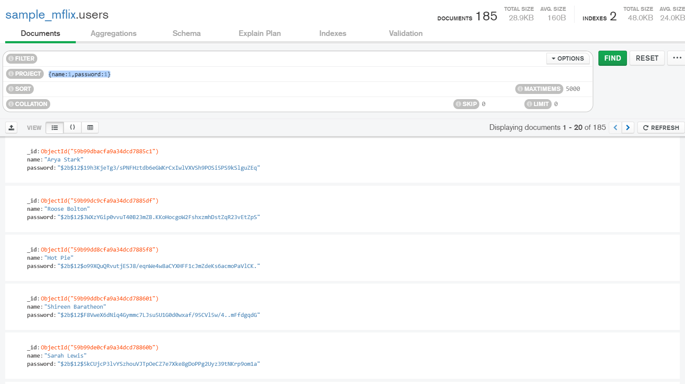
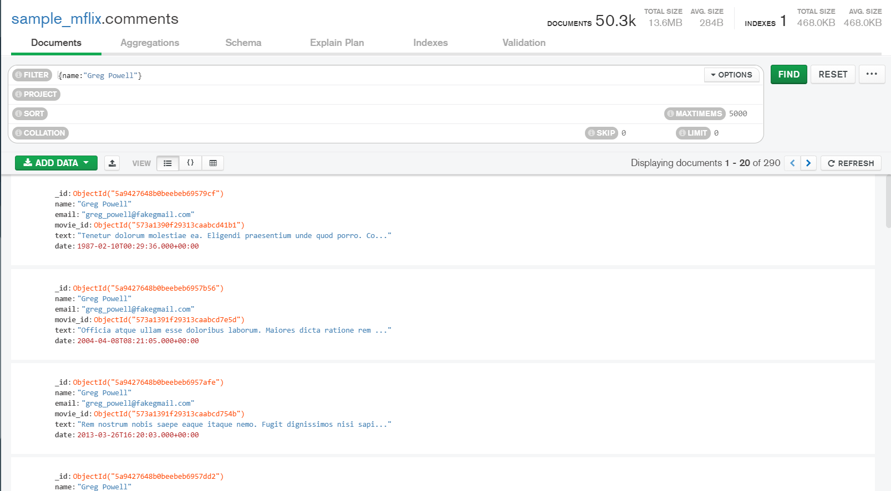
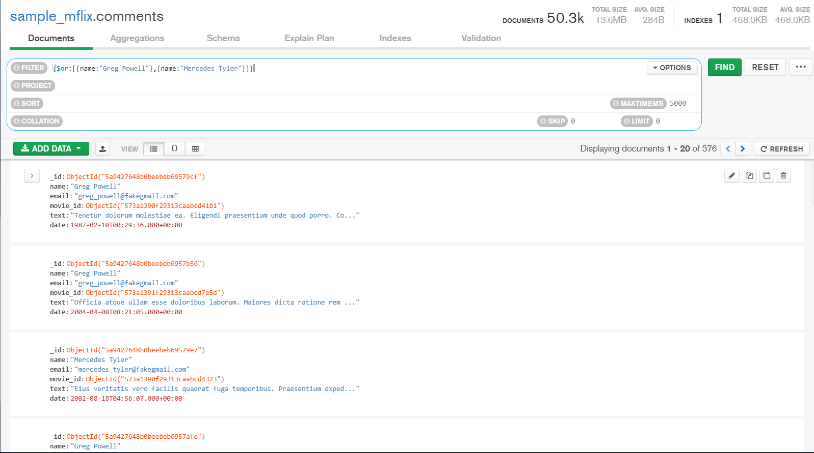

# Sesion 4

### Fecha, nombre y texto de cada comentario.

```json
{
    date:1,
    name:1,
    text:1
}
```




### Título, elenco y año de cada película.

```json
{
    title:1,
    cast:1,
    year:1
}
```



### Nombre y contraseña de cada usuario.

```json
{
    name:1,
    password:1
}
```




## Reto 2

### ¿Qué comentarios ha hecho Greg Powell?

```json
{name:"Greg Powell"}
```



### ¿Qué comentarios han hecho Greg Powell o Mercedes Tyler?

```json
{
    $or:[
        {name:"Greg Powell"},
        {name:"Mercedes Tyler"}
    ]
}
```




