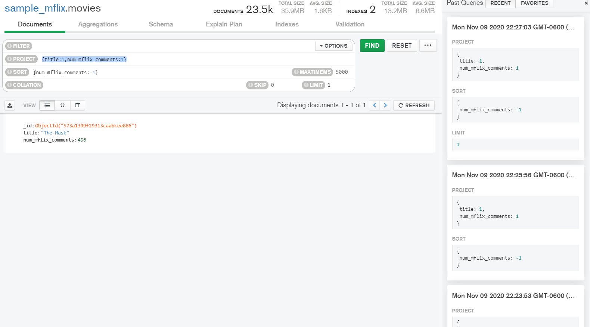
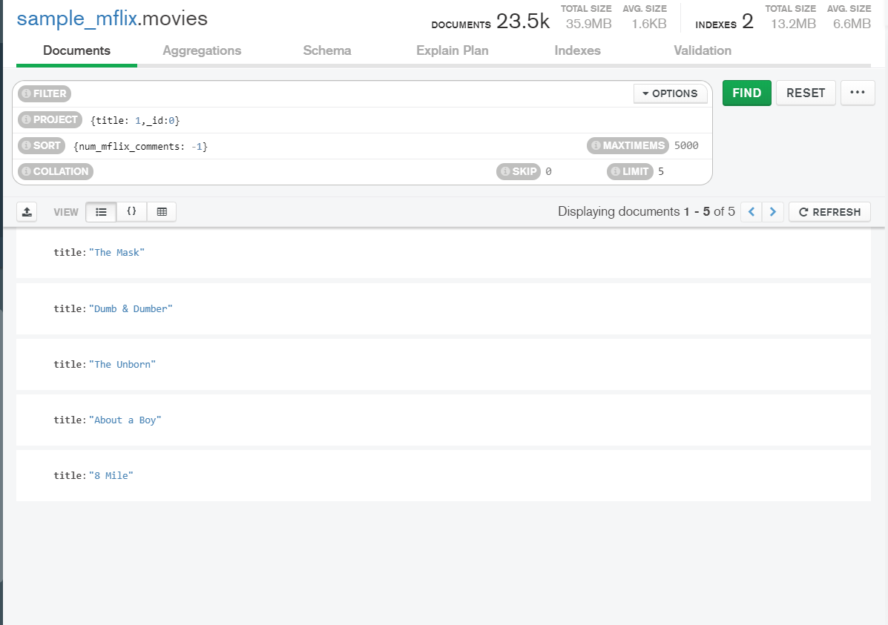

# Sesion 4

## Reto 1


### Fecha, nombre y texto de cada comentario.

```json
{
    date:1,
    name:1,
    text:1
}
```


### Título, elenco y año de cada película.

```json
{
    title:1,
    cast:1,
    year:1
}
```


### Nombre y contraseña de cada usuario.

```json
{
    name:1,
    password:1
}
```


## Reto 2

### ¿Qué comentarios ha hecho Greg Powell?

```json
{name:"Greg Powell"}
```


### ¿Qué comentarios han hecho Greg Powell o Mercedes Tyler?

```json
{
    $or:[
        {name:"Greg Powell"},
        {name:"Mercedes Tyler"}
    ]
}
```


### ¿Cuál es el máximo número de comentarios en una película?

```json
{
 project: {
  title: 1,
  num_mflix_comments: 1
 },
 sort: {
  num_mflix_comments: -1
 },
 limit: 1
}
```




### ¿Cuál es título de las cinco películas más comentadas?

```json
{
 project: {
  title: 1,
  _id: 0
 },
 sort: {
  num_mflix_comments: -1
 },
 limit: 5
}
```

